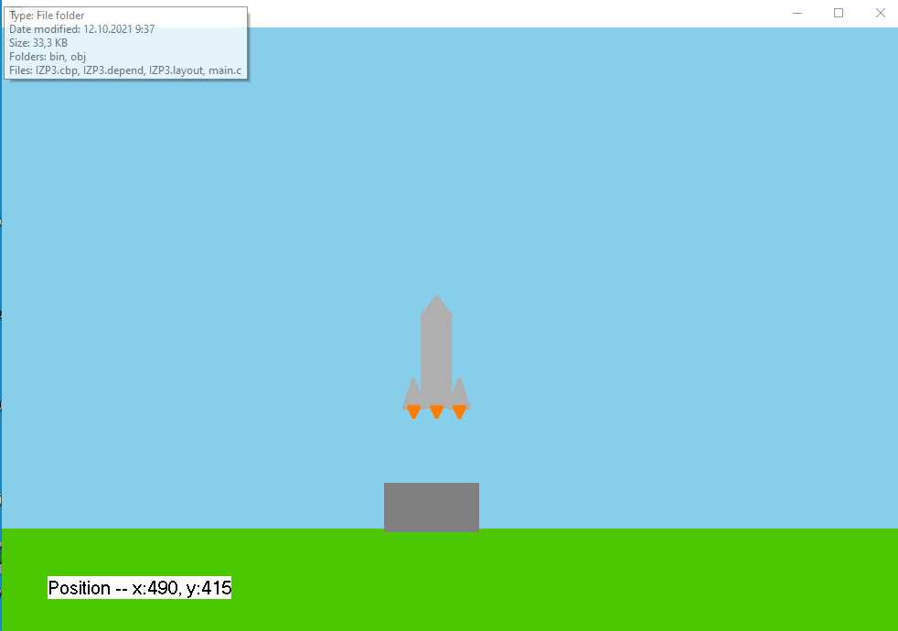

# GUIExerciseWinAPI
GUI small rocket game using WinAPI
## Rocket Painting Application

This is a simple Windows application written in C that allows you to paint a rocket on a canvas and move it using arrow keys. The application also displays the rocket's current position. Additionally, when you click the left mouse button, the rocket's color changes. Below is a brief description of the code and its functionalities.

## Code Overview

### Dependencies
- Windows API (`windows.h`)
- Standard C Libraries (`string.h`, `stdio.h`, `math.h`)

### Global Variables
- `HINSTANCE hInst`: Handle to the application instance.
- `UINT MessageCount`: Counter for the number of messages processed.
- `UINT Count`: Counter.
- `int posX`: X-coordinate of the rocket's position.
- `int posY`: Y-coordinate of the rocket's position.
- `COLORREF color1`: Current color of the rocket.

### Functions
1. `WinMain`: The main entry point of the application. It registers the window class, creates the main window, and handles message processing.

2. `MainWndProc`: The window procedure that handles various window messages such as keyboard input, mouse input, and painting.

3. `paintObject`: Paints the background of the canvas, representing the sky, ground, and a ramp.

4. `mypaintObject`: Paints the rocket with its main body, tip, and engine parts. The color of the rocket can change.

5. `paintPosition`: Displays the current position of the rocket.

## How to Use

- Use the arrow keys (up, down, left, right) to move the rocket around the canvas.
- Click the left mouse button to change the rocket's color.
- Observe the rocket's position displayed at the bottom of the canvas.

## Example

## Dependencies
- Windows operating system (Tested on Windows)

## Building and Running
1. Compile the code using a C compiler that supports Windows API (e.g., Visual Studio, MinGW).
2. Run the compiled executable.

